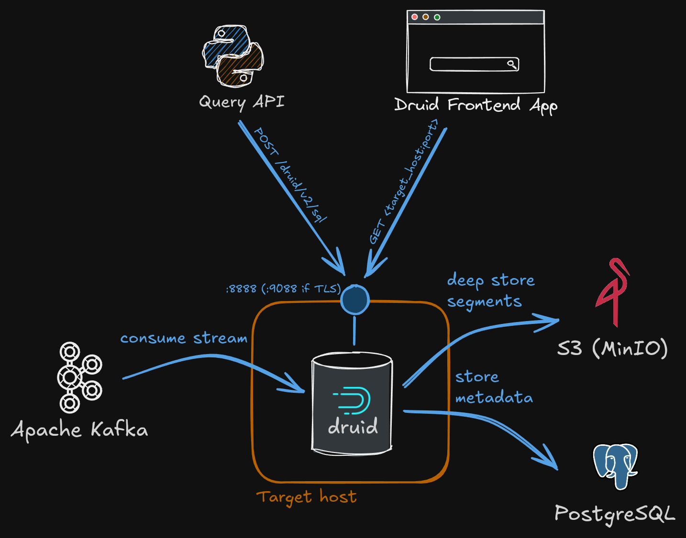
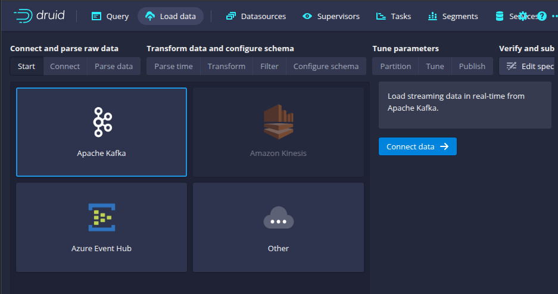

# Apache Druid Deployment

This project implements a single-node Apache Druid deployment with the following setup:

* Single-node Druid deployment (with optional TLS)
* Data is ingested from Apache Kafka
* Segments are deep stored in S3 storage (e.g., MinIO)
* Metadata is stored in PostgreSQL



The deployment consists of two playbooks:

`deploy.yml`:
* Installs Java 17 (and other prerequisites)
* Generates necessary Java keystores (if TLS is used)
* Deploys Druid

> [!WARNING]
> The deploy task downloads Druid binaries from
> https://dlcdn.apache.org/druid. This may sometimes time out.
>
> Also, check the version that is being downloaded.
> This playbook has been tested with version 32.0.0.

`configure.yml`:
* Creates necessary Druid users and roles

# Table of contents
* [Prerequisites](#prerequisites)
* [Example Inventory](#example-inventory)
* [Configuration](#configuration)
* [Druid Roles and Users](#druid-roles-and-users)
* [Druid TLS](#druid-tls)
* [PostgreSQL](#s3)
* [S3](#s3)
* [Dataloader](#dataloader)
* [Kafka](#kafka)

# Prerequisites

* `CentOS 9`/`AlmaLinux 9` target node.
* `ansible` user with SSH key pair access and sudo.
* PostgreSQL with a `druid` database and credentials to access the database.
* S3 storage with a `druid` bucket and access and secret keys that will be used by Druid.
* Kafka

# Example inventory
```yaml
all:
  children:
    dev:
      hosts:
        # Without TLS
        192.168.42.33:
            postgresql_connection_uri: "postgresql://192.168.42.42:5432/druid"
            druid_s3_endpoint: "http://192.168.42.43:9000"
    prod:
      hosts:
        # With TLS
        192.168.69.33:
            postgresql_connection_uri: "postgresql://192.168.69.42:5432/druid"
            druid_s3_endpoint: "http://192.168.69.43:9000"
            druid_tls: true
            druid_tls_cert: certs/druid.example.com.crt
            druid_tls_key: certs/druid.example.com.key
            druid_domain: druid.example.com
  vars:
    # Ansible access:
    ansible_ssh_user: ansible
    ansible_ssh_common_args: '-o StrictHostKeyChecking=no'
    ansible_private_key_file: "{{ lookup('ansible.builtin.env', 'SSH_PRIVATE_KEY') }}"
    ansible_python_interpreter: /usr/bin/python3
    # ansible_become_password: somepass 
    # TLS (false by default):
    druid_tls: false
    druid_host_tls_cert_path: /tmp/druid-cert.pem
    druid_host_tls_key_path: /tmp/druid-key.pem
    druid_truststore_path: /opt/druid/truststore.jks
    druid_keystore_path: /opt/druid/keystore.jks
    druid_keystore_password: "{{ lookup('ansible.builtin.env', 'DRUID_KEYSTORE_PASSWORD') }}"
    # S3:
    druid_s3_access_key: "{{ lookup('ansible.builtin.env', 'DRUID_S3_ACCESS_KEY') }}"
    druid_s3_secret_key: "{{ lookup('ansible.builtin.env', 'DRUID_S3_SECRET_KEY') }}"
    druid_segments_s3_bucket: druid
    # PostgreSQL:
    postgresql_password: "{{ lookup('ansible.builtin.env', 'POSTGRESQL_PASSWORD') }}"
    postgresql_user: "{{ lookup('ansible.builtin.env', 'POSTGRESQL_USER') }}"
    # Passwords for mandatory users:
    druid_admin_password: "{{ lookup('ansible.builtin.env', 'DRUID_ADMIN_PASSWORD') }}"
    druid_system_user_password: "{{ lookup('ansible.builtin.env', 'DRUID_SYSTEM_USER_PASSWORD') }}"
    # Custom Roles and Users:
    druid_roles:
      - readonly_role
      - readonly_myawesome_datasource
    druid_users:
      - username: tester
        password: "{{ lookup('ansible.builtin.env', 'DRUID_TESTER_USER_PASSWORD') }}"
        role: readonly_role
      - username: user1
        password: "{{ lookup('ansible.builtin.env', 'DRUID_USER1_USER_PASSWORD') }}"
        role: readonly_myawesome_datasource
```

# Configuration


### Mandatory env variables

| Variable Name                | Example Value     | Description                                                                                      |
|------------------------------|-------------------|--------------------------------------------------------------------------------------------------|
| `SSH_PRIVATE_KEY`            | `/path/to/key`    | Path to an SSH key used by Ansible to access the target host where Druid will be installed.      |
| `DRUID_S3_ACCESS_KEY`        | `minioaccesskey`  | MinIO access key (see [MinIO](minio) section).                                                   |
| `DRUID_S3_SECRET_KEY`        | `miniosecretkey`  | MinIO secret key (see [MinIO](minio) section).                                                   |
| `ENV_TARGET`                 | `dev`             | Target host group (e.g., `dev`, `prod`).                                                         |
| `DRUID_ADMIN_PASSWORD`       | `strongpass`      | Password for `admin` user (this is a mandatory user).                                            |
| `DRUID_SYSTEM_USER_PASSWORD` | `strongpass`      | Password for `druid_system` user (this is a mandatory user).                                     |
| `POSTGRESQL_USER`            | `druid`           | PostgreSQL user with access to the db specified by `postgresql_connection_uri` in the inventory file |
| `POSTGRESQL_PASSWORD`        | `strongpass`      | Password for the PostgreSQL user

### Optional env variables


| Variable Name                | Example Value     | Description                                                                                      |
|------------------------------|-------------------|--------------------------------------------------------------------------------------------------|
| `DRUID_KEYSTORE_PASSWORD`    | `strongpass`      | When Druid TLS is set to `true`, the Druid Java keystore password needs to be specified.

# Druid TLS

It is possible to enable TLS for Druid. For that, a certificate and key for
your domain need to be provided. You can specify that through the inventory file:

```yaml
     druid_tls: true
     druid_tls_cert: ./certs/druid.example.com.crt
     druid_tls_key: ./certs/druid.example.com.key
     druid_domain: druid.example.com
```

Ansible task `generate_java_keystores.yml` will use them to generate Java
keystore and truststore for Druid. The password for the generated keystore
and truststore is configured via an ENV variable `DRUID_KEYSTORE_PASSWORD`.


Druid's TLS is then configured by
[common.runtime.properties.j2](templates/common.runtime.properties.j2)

# Druid Roles and Users

You can create custom roles and users. An example role that allows read-only
access to all available Druid resources can be found in
[files/readonly_role.json](files/readonly_role.json). An example of a very
restrictive role that allows read-only access to only a single datasource
(i.e., table) and nothing else can be found in
[files/readonly_myawesome_datasource.json](files/readonly_myawesome_datasource.json).

You can define custom users and link them to custom roles through inventory:

```yaml
    druid_roles:
      - readonly_role
      - readonly_myawesome_datasource
    druid_users:
      - username: tester
        password: "{{ lookup('ansible.builtin.env', 'DRUID_TESTER_USER_PASSWORD') }}"
        role: readonly_role
      - username: user1
        password: "{{ lookup('ansible.builtin.env', 'DRUID_USER1_USER_PASSWORD') }}"
        role: readonly_myawesome_datasource
```

# S3

This Druid deployment uses S3 (MinIO) as a deep storage backend
(i.e., long-term persistence of Druid segments). For this:

* Druid credentials (access key and secret key) need to be created in MinIO and configured via environment variables.
* A bucket called `druid` needs to exist in MinIO (and the credentials from the previous step need to have write access to it).

```yaml
    druid_s3_access_key: "{{ lookup('ansible.builtin.env', 'DRUID_S3_ACCESS_KEY') }}"
    druid_s3_secret_key: "{{ lookup('ansible.builtin.env', 'DRUID_S3_SECRET_KEY') }}"
    druid_segments_s3_bucket: druid
```

# PostgreSQL

This deployment offloads metadata to PostgreSQL. This makes sense when you
already have a robust (HA, backups, etc.) PostgreSQL deployment in your
environment. For that to work, the PostgreSQL database must be specified,
along with credentials that have proper access to the database.

```yaml
    postgresql_connection_uri: "postgresql://<psql-host>:5432/druid"
    postgresql_password: "{{ lookup('ansible.builtin.env', 'POSTGRESQL_PASSWORD') }}"
    postgresql_user: "{{ lookup('ansible.builtin.env', 'POSTGRESQL_USER') }}"
```

# Dataloader configuration

For Druid to start consuming data from a Kafka stream, a Druid data loader
needs to be configured using the Druid UI.



The result of the UI configuration process will be a JSON that can then be
persisted somewhere (e.g., Git). An example data loader JSON configuration
can be seen in [dataloader.json](examples/dataloader.json).

# Kafka

Kafka client configuration is done when defining a new dataloader in Druid
(see [Dataloader configuration](#dataloader-configuration)). A very simple
Kafka client configuration (single node without TLS) would look like this:

```json
"consumerProperties": {
  "bootstrap.servers": "<kafka-server>:9092"
}
```

It is also possible to configure the Kafka client with TLS and SASL.
For that, you will first need to copy Kafka certificates
(`truststore.jks` and `keystore.jks`) to the Druid host.
Then, properly (re)configure `consumerProperties` in your dataloader:

```json
"consumerProperties": {
  "bootstrap.servers": "server1:9092", "server2:9092",
  "security.protocol": "SASL_SSL",
  "sasl.mechanism": "PLAIN",
  "sasl.username": "<kafka_user>",
  "sasl.password": "<kafka_user_password>",
  "sasl.jaas.config": "org.apache.kafka.common.security.plain.PlainLoginModule required username='<kafka_user>' password='<kafka_user_password>';",
  "ssl.truststore.location": "/path/to/truststore.jks",
  "ssl.truststore.password": "<truststore_password>",
  "ssl.keystore.location": "/path/to/keystore.jks",
  "ssl.keystore.password": "<keystore_password>"
}
```
